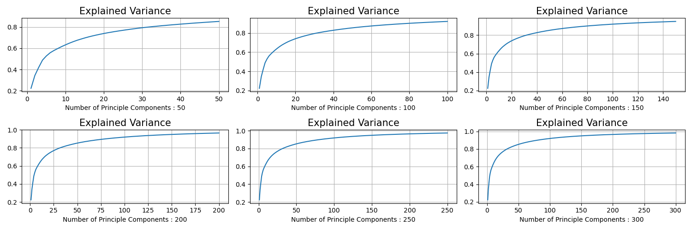
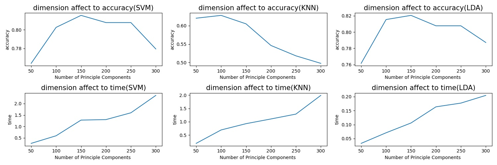

# 종합설계
## Real-time mosaic system based on face recognition 
### Classifier selection
> candidate : LDA, MLPC, SVM, KNN

### feature extraction
> PCA(Principal Component Analysis), Embedding

## Dataset (from sklearn.datasets import fetch_lfw_people)
* Experiment(using PCA)

## Future plans
* PCA + Classifier 조합을 celeba dataset으로 테스트 후 classifier결정.
* PCA + Classifier 조합과 Embedding + Classifier 조합 성능비교.

## Reference
[celeba](http://mmlab.ie.cuhk.edu.hk/projects/CelebA.html)
