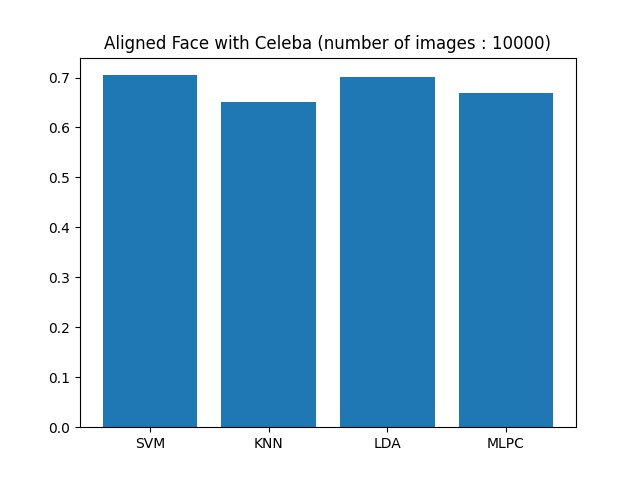
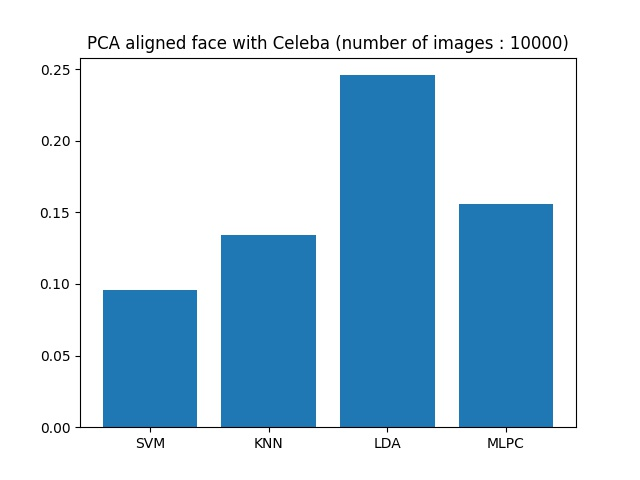
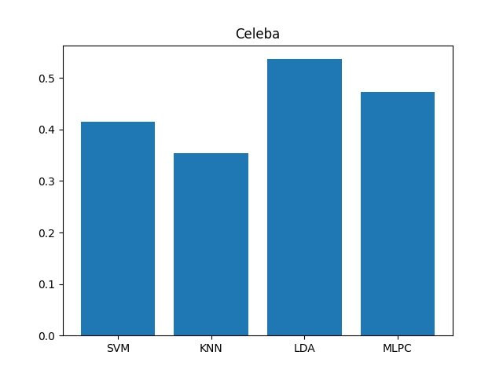
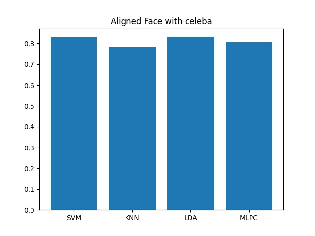
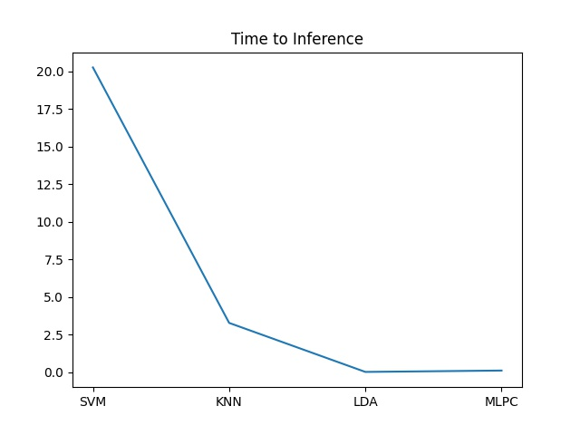

# Real-time mosaic system based on face recognition
길거리에서 방송할 때 방송에 자신의 얼굴이 나오는지도 모르는채로 초상권 침해가 빈번히 이루어 지고 있음.         
이 현상을 방지하고자 만든 시스템.
## Classifier selection
> * LDA
> * MLPC
> * SVM
> * KNN

## Feature extraction
> * PCA(Principal Component Analysis)
> * Embedding


## Dataset
 ```from sklearn.datasets import fetch_lfw_people```     ```min_faces_per_person=50``` ```number of classes: 12``` ```number of images: 1560```
> * Experiment (using PCA)


```from sklearn.datasets import fetch_olivetti_faces``` ```number of classes: 40``` ```number of images : 400```
> 
  
## Accuracy comparison
> * ### PCA vs Embedding
> ```Dataset : Celeba``` ```number of images : 10000``` ```number of classes : 500```
<br/>  

## Embedding
> * ### Aligned Face vs Without Aligned Face   
> ```Dataset : Celeba``` ```number of images : 2000``` ```number of classes : 100```    
> 
> * ### Time to Inference
>     


## Problem  
* Celeba dataset은 sklearn의 dataset과는 달리 형식화 되어 있지 않은 이미지가 많음(명암, 각도등).     
* PCA는 sklearn의 dataset에서는 좋은 성능을 보였지만 Celeba에서는 좋지 않은 결과를 보임.    


## Future plans
> ~~1. PCA + Classifier 조합을 celeba dataset으로 테스트 후 classifier결정.~~   
> ~~2. PCA + Classifier 조합과 Embedding + Classifier 조합 성능비교.~~      
> 3. 메모리에 올릴수 있는 Celeba dataset의상한을 구하고 그 데이터로 각 모델별로 GridSearchCV를 사용하여 적절한 parameter값을 구하고 다시 비교.   
> 4. 정확도와 속도는 trade-off관계이기 때문에 3번의 결과로 적절히 타협을 봐야함.


## Reference
[1][celeba](http://mmlab.ie.cuhk.edu.hk/projects/CelebA.html)           
[2][Ultra-Light-Fast-Generic-Face-Detector-1MB](https://github.com/Linzaer/Ultra-Light-Fast-Generic-Face-Detector-1MB)   
[3][Openface](https://cmusatyalab.github.io/openface/)   
[4][Embedding Guide](https://medium.com/@ageitgey/machine-learning-is-fun-part-4-modern-face-recognition-with-deep-learning-c3cffc121d78#.ds8i8oic9)   
[5][FaceNet](https://www.cv-foundation.org/openaccess/content_cvpr_2015/papers/Schroff_FaceNet_A_Unified_2015_CVPR_paper.pdf)
