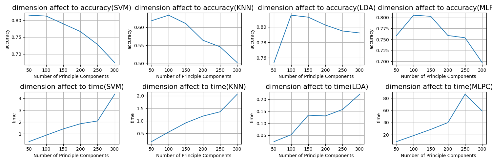
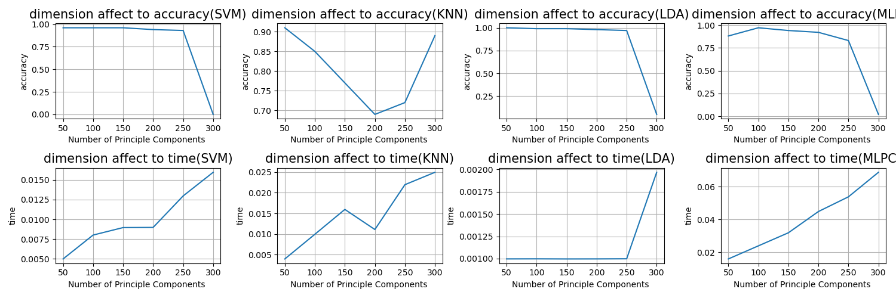

# Real-time mosaic system based on face recognition
길거리에서 방송할 때 방송에 자신의 얼굴이 나오는지도 모르는채로 초상권 침해가 빈번히 이루어 지고 있음.         
이 현상을 방지하고자 만든 시스템.
## Classifier selection
> * LDA
> * MLPC
> * SVM
> * KNN

## Feature extraction
> * PCA(Principal Component Analysis)
> * Embedding


## Dataset
 ```from sklearn.datasets import fetch_lfw_people```     ```min_faces_per_person=50``` ```number of classes: 12``` ```number of images: 1560```
> * Experiment (using PCA)




```from sklearn.datasets import fetch_olivetti_faces``` ```number of classes: 40``` ```number of images : 400```
> 

## Future plans
> 1. PCA + Classifier 조합을 celeba dataset으로 테스트 후 classifier결정.
> 2. PCA + Classifier 조합과 Embedding + Classifier 조합 성능비교.

## Reference
[1][celeba](http://mmlab.ie.cuhk.edu.hk/projects/CelebA.html)           
[2][Ultra-Light-Fast-Generic-Face-Detector-1MB](https://github.com/Linzaer/Ultra-Light-Fast-Generic-Face-Detector-1MB)   
[3][Openface](https://cmusatyalab.github.io/openface/)   
[4][Embedding Guide](https://medium.com/@ageitgey/machine-learning-is-fun-part-4-modern-face-recognition-with-deep-learning-c3cffc121d78#.ds8i8oic9)
