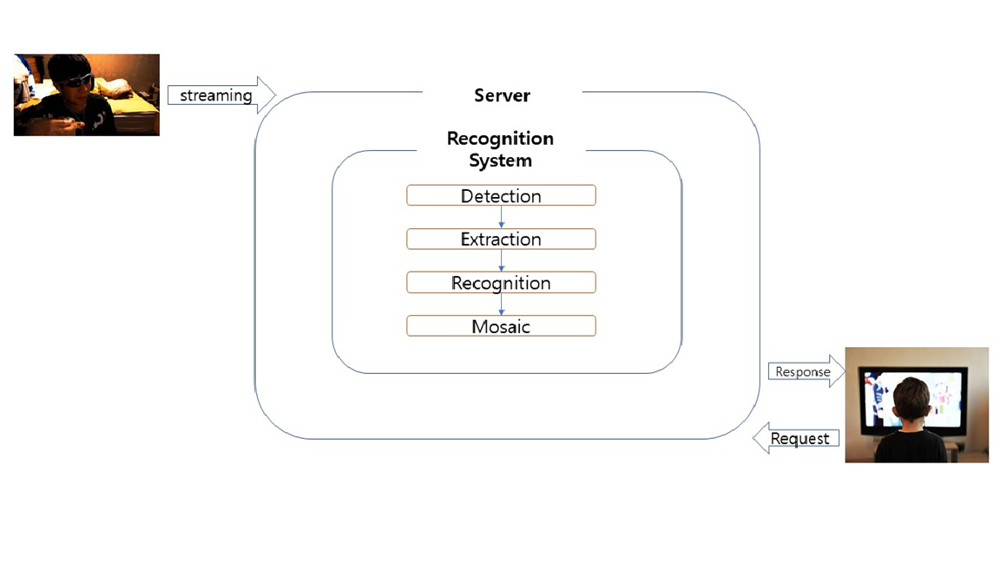
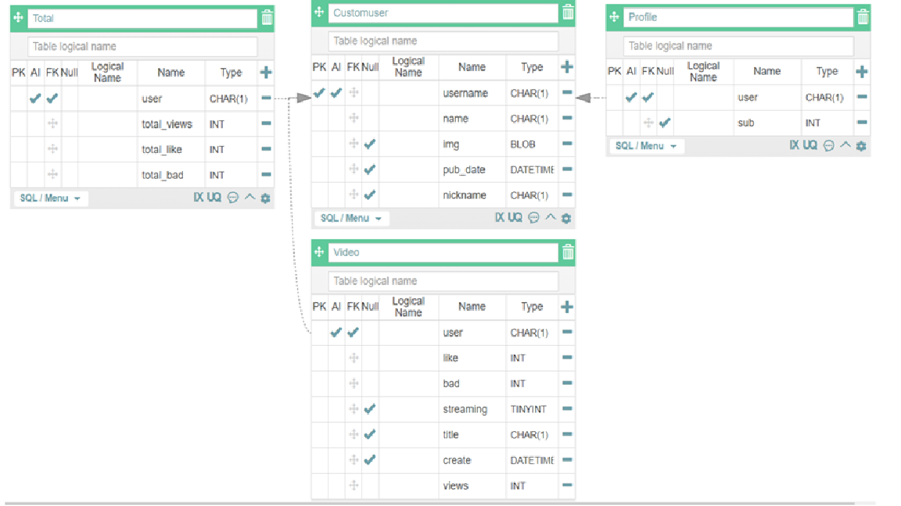
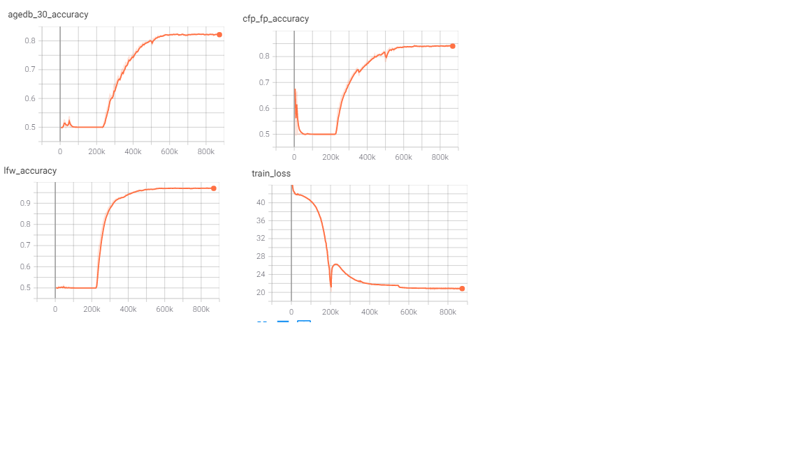
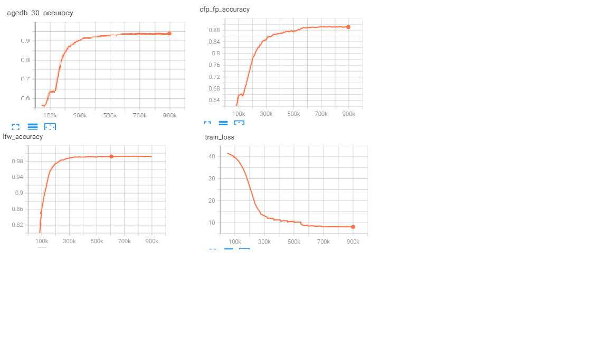
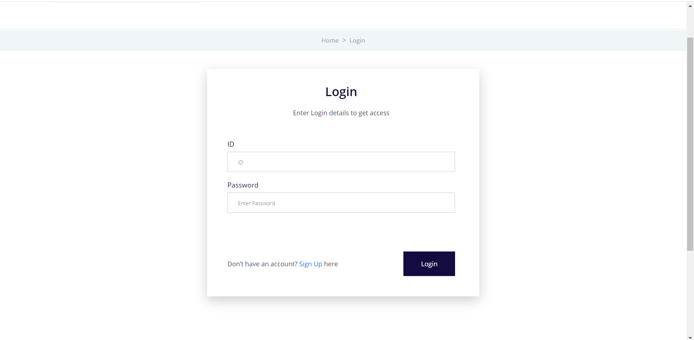
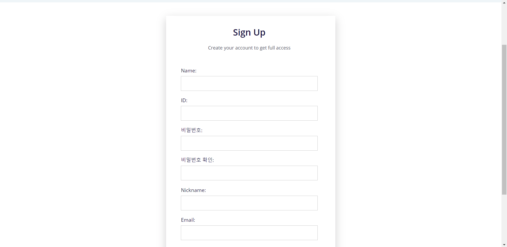
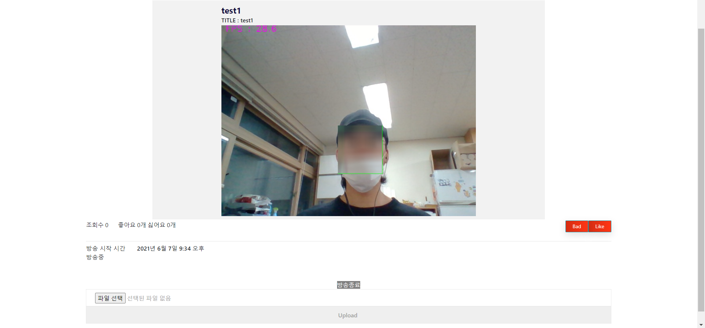

# Real-time mosaic system based on face recognition
길거리에서 방송할 때 방송에 자신의 얼굴이 나오는지도 모르는채로 초상권 침해가 빈번히 이루어 지고 있음. 이러한 침해를 방지하기 위해 만든 시스템.  
사용자(BJ)의 얼굴을 제외한 나머지 얼굴은 Detection후 blurring하여 송출함. 특정 얼굴을 blurring해제하고 싶으면 해당하는 얼굴이미지를 업로드하면 실시간으로 반영이 되어 blurring해제가 이루어짐.

# How to Work?   
1. OpenCv로 웹캠에서 Image를 전송받아 Face Detection을 진행함.   
2. Detection된 얼굴들을 대상으로 feature extraction진행.   
3. 추출한 특징으로 사용자(BJ)의 facebank에 있는 특징들과 비교하여 Threshold보다 낮으면 blurring, 높으면 pass.

## Dependency
* torch==1.6.0
* CUDA==10.1
* MYSQL
* Django==3.1.3

## Function block diagram

## Sequence diagram

## Database

## Train log
* ### train dataset : MS1M-ArcFace(85K ids/5.8M images) 
* ### Model         : MobileFaceNet
* ### environment   : Colab(pro)
* 128-D
     

* 512-D

## Problem  
* Celeba dataset은 sklearn의 dataset과는 달리 형식화 되어 있지 않은 이미지가 많음(명암, 각도등).     
* PCA는 sklearn의 dataset에서는 좋은 성능을 보였지만 Celeba에서는 좋지 않은 결과를 보임.    
* PCA로 차원축소를 진행하고 classifier(SVM,KNN,LDA)를 사용하는 것은 open-set에서는 성능이 보장되지 않음.   
* 모바일에서 글자 또는 nav-bar가 보이지 않는 현상발생   
* 처음 방송시에 facebank는 사용자가 수동으로 만들어 주어야 함.   
* 현재는 opencv의 VideoCapture()로 Webcam에서 이미지를 받아오게 되어있음. 하지만 본래의 목적은 방송 플랫폼을 만드는 것이기 때문에 방법의 변화가 필요함.

## Future plans
> ~~1. PCA + Classifier 조합을 celeba dataset으로 테스트 후 classifier결정.~~   
> ~~2. PCA + Classifier 조합과 Embedding + Classifier 조합 성능비교.~~      
> ~~3. 메모리에 올릴수 있는 Celeba dataset의 상한을 구하고 그 데이터로 각 모델별로 GridSearchCV를 사용하여 적절한 parameter값을 구하고 다시 비교.~~     
> ~~4. 정확도와 속도는 trade-off관계이기 때문에 3번의 결과로 적절히 타협을 봐야함.~~    
> ~~5. InsightFace의 Third-party pytorch version을 사용하되 Colab을 사용해야하기 때문에 지속적으로 학습 가능한 코드를 추가.~~   
> ~~6. 적응형으로 UI바꾸기.~~    
> ~~7. 비동기방식으로 좋아요, 싫어요 구현하기~~   
> ~~8. 128-d, 512-d 둘 다 학습시켜서 inference time비교 및 open-set에서의 작동 여부 확인.~~   
> ~~9. 구현된 페이지를 URL 연결.~~   
> ~~10. Database에서 현재 streaming중인 streamer의 이미지를 가져와 main page에 뿌리고 slide로 동작하게 한다.~~   

## Result
* ### Main 
   

* ### Login 
   

* ### sign-up
   

* ### Profile

* ### Stream

## Reference
[1][celeba](http://mmlab.ie.cuhk.edu.hk/projects/CelebA.html)           
[2][Ultra-Light-Fast-Generic-Face-Detector-1MB](https://github.com/Linzaer/Ultra-Light-Fast-Generic-Face-Detector-1MB)   
[3][Openface](https://cmusatyalab.github.io/openface/)   
[4][Embedding Guide](https://medium.com/@ageitgey/machine-learning-is-fun-part-4-modern-face-recognition-with-deep-learning-c3cffc121d78#.ds8i8oic9)   
[5][FaceNet](https://www.cv-foundation.org/openaccess/content_cvpr_2015/papers/Schroff_FaceNet_A_Unified_2015_CVPR_paper.pdf)     
[6][InsightFace](https://github.com/deepinsight/insightface)   
[7][Django](https://docs.djangoproject.com/ko/3.2/intro/)    
[8][Jump to Django](https://wikidocs.net/book/4223)
